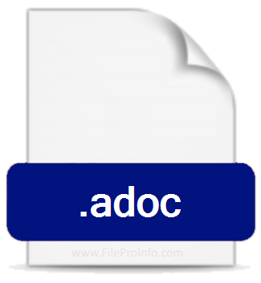

= AsciiDoc Article Title
Firstname Lastname <author@asciidoctor.org>
3.0, July 29, 2022: AsciiDoc article template
:toc:
:icons: font
:url-quickref: https://docs.asciidoctor.org/asciidoc/latest/syntax-quick-reference/

== Image

.Image caption

