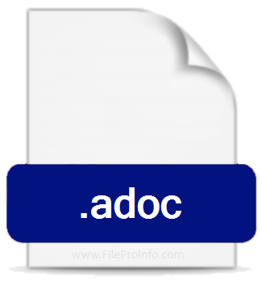

= AsciiDoc Article Title
Firstname Lastname <author@asciidoctor.org>
3.0, July 29, 2022: AsciiDoc article template
:toc:
:icons: font
:url-quickref: https://docs.asciidoctor.org/asciidoc/latest/syntax-quick-reference/

== Link

https://github.com/YabMas/git-for-confluence-test

== Image

.Image caption

== Code-block

[,clojure]
----
(defmethod render-content render-format-options/markdown
  [env resource]
  (p/let [content (markdown/markdown->html env resource)]
    {:type      :html
     :html-head source-code/source-code-html-head
     :content   (sanitize content #js {"ADD_ATTR" #js ["target"]})}))
----

== Diagram

[ditaa]
....
                   +-------------+
                   | Asciidoctor |-------+
                   |   diagram   |       |
                   +-------------+       | PNG out
                       ^                 |
                       | ditaa in        |
                       |                 v
 +--------+   +--------+----+    /---------------\
 |        | --+ Asciidoctor +--> |               |
 |  Text  |   +-------------+    |   Beautiful   |
 |Document|   |   !magic!   |    |    Output     |
 |     {d}|   |             |    |               |
 +---+----+   +-------------+    \---------------/
     :                                   ^
     |          Lots of work             |
     +-----------------------------------+
....
