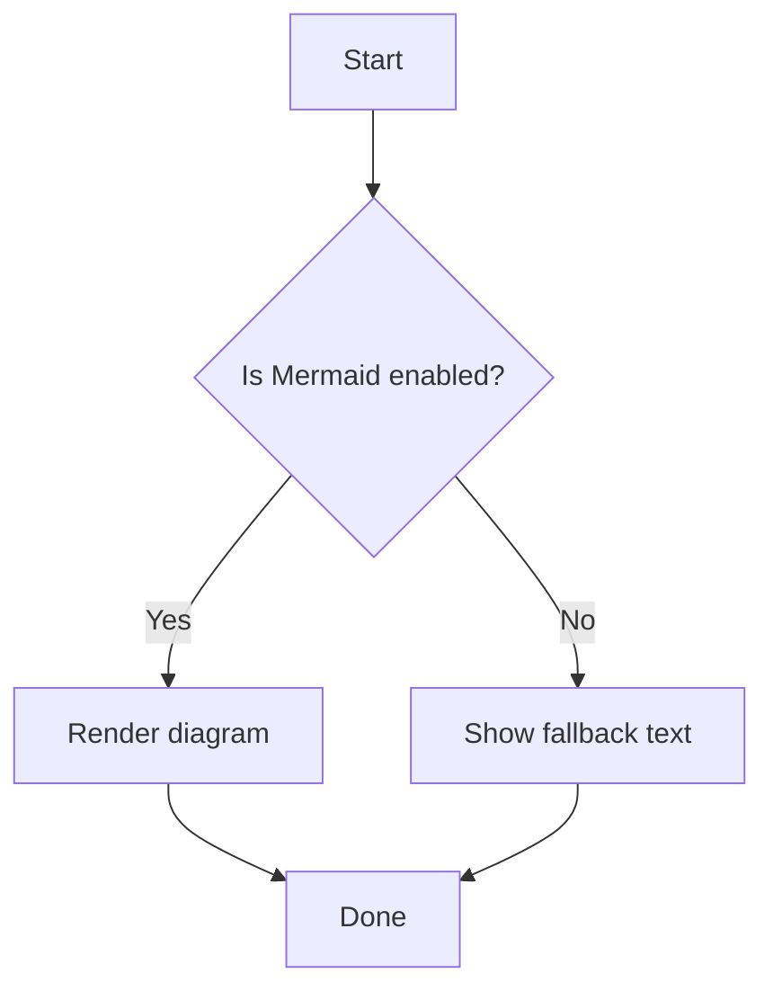

# Mermaid Diagram Example

This is a sample Markdown document that includes a Mermaid flowchart.

```mermaid
flowchart TD
    A[Start] --> B{Is Mermaid enabled?}
    B -- Yes --> C[Render diagram]
    B -- No --> D[Show fallback text]
    C --> E[Done]
    D --> E[Done]
```

If Mermaid rendering is supported, the diagram appears above.